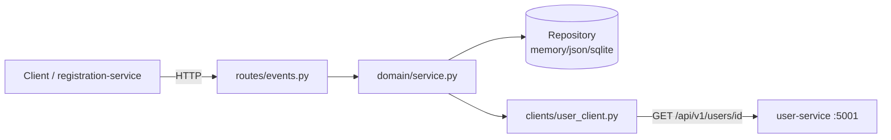
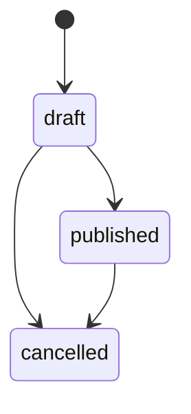

# Design — event-service

Riferimento contratto: `contracts/openapi/event-service.yaml` (fonte di verità per campi, tipi e status code — ogni endpoint qui sotto deve rispettarlo).

## Overview

Il **event-service** è il secondo microservizio obbligatorio della piattaforma TechConf.
Gestisce le conferenze (eventi) con ciclo di vita (`draft`/`published`/`cancelled`) e
capienza. A differenza di user-service, event-service **chiama un altro servizio**: valida
l'`organizer_id` di ogni evento interrogando user-service via HTTP. Il servizio ascolta
sulla porta `PORT` (default 5002), espone `/api/v1/events` e conforma ogni risposta al
contratto OpenAPI.

## Architettura e Componenti

```
services/event-service/
  app.py               # crea la app Flask, registra la blueprint + errorhandler, avvia su PORT (python -m app)
  config.py            # legge PORT, STORAGE_BACKEND, DATA_DIR, USER_SERVICE_URL
  routes/
    events.py            # HTTP: parsing query/body, chiamata al service layer, status code, Location
  domain/
    models.py            # dataclass Event + enum EventStatus + macchina a stati transizioni
    service.py           # REQ-EVT-B01..B06, C01..C05, V01 (regole di business)
  repository/
    base.py                # interfaccia: create/get/list(filters,page,page_size)/update/delete
    memory_repo.py
    json_repo.py
    sqlite_repo.py
    factory.py              # sceglie l'implementazione da STORAGE_BACKEND
  clients/
    user_client.py          # client HTTP verso user-service, isolato dietro interfaccia (mockabile con responses)
  errors.py                 # formato errore comune {"error": {code, message, details}} + eccezioni di dominio
  pagination.py              # helper page/page_size/total
  tests/
    unit/                   # repository (3 backend), regole di business (HTTP mockato con responses), contratto
    integration/            # avvia user-service reale: caso positivo, organizer mancante (422), user-service down (503)
```

Il flusso di una richiesta: `routes/events.py` fa il parsing e delega a `domain/service.py`;
il service layer applica le regole di business, usa `clients/user_client.py` per validare
l'organizzatore e `repository/base.py` per la persistenza; le eccezioni di dominio risalgono
all'errorhandler in `app.py` che le mappa a status code.

### Diagramma delle dipendenze



## Data Models

`domain/models.py` definisce la dataclass `Event` con i campi del contratto: `id` (UUID v4),
`title`, `description` (opzionale), `organizer_id`, `venue`, `city`, `start_date`,
`end_date`, `capacity`, `price`, `status`, `created_at`, `updated_at`. `EventStatus` è un
enum `draft | published | cancelled`. I campi `id`, `created_at`, `updated_at` sono
generati dal server e non accettati in input (REQ-EVT-V01 p.8). `price` è normalizzato a 2
decimali.

## Persistenza

`repository/base.py` definisce l'interfaccia usata da `domain/service.py`. `factory.py`,
chiamato da `app.py` all'avvio, istanzia `MemoryEventRepository`, `JsonEventRepository` o
`SqliteEventRepository` in base a `STORAGE_BACKEND` e la inietta nel service layer. Le tre
implementazioni espongono la stessa interfaccia (`create`, `get`, `list(filters, page,
page_size)`, `update`, `delete`), quindi `domain/service.py` non sa mai quale backend è
attivo (REQ-EVT-S01 p.5).

- `memory`: dizionario `{id: Event}` in RAM.
- `json`: un file `DATA_DIR/events.json` con lock su file per evitare scritture concorrenti
  corrotte (unico processo per servizio).
- `sqlite`: `DATA_DIR/events.db`, tabella `events`, libreria standard `sqlite3`.

I filtri `status` e `city` (REQ-EVT-B06) e la paginazione sono applicati in modo uniforme:
il service layer passa i filtri al repository che li applica sulla collezione, così il
comportamento è identico sui tre backend.

## Chiamate ad altri servizi

event-service chiama **solo** user-service, isolato dietro `clients/user_client.py`. Questo
isolamento permette di mockare le chiamate HTTP con la libreria `responses` nei test unit.

### Validazione dell'organizzatore

`UserClient.get_user(organizer_id)` esegue:

```
GET {USER_SERVICE_URL}/api/v1/users/{organizer_id}   (timeout = 2s)
```

Mappatura del risultato (REQ-EVT-B01, B02, B05):

| Risultato della chiamata                              | Comportamento event-service                         |
|-------------------------------------------------------|-----------------------------------------------------|
| HTTP 200 e `role == organizer`                        | Organizzatore valido → prosegui                     |
| HTTP 200 e `role != organizer`                        | 422 `INVALID_ORGANIZER`                             |
| HTTP 404                                              | 422 `REFERENCE_NOT_FOUND`                           |
| Timeout / ConnectionError / HTTP 5xx                  | 503 `DEPENDENCY_UNAVAILABLE`                         |

La validazione dell'organizzatore avviene:
- **sempre** su `POST /api/v1/events`;
- su `PUT`/`PATCH` **solo quando** l'`organizer_id` cambia rispetto al valore memorizzato
  (REQ-EVT-B02 p.5, p.6); se non cambia, nessuna chiamata a user-service.

`clients/user_client.py` traduce gli esiti HTTP/di rete nelle eccezioni di dominio
(`ReferenceNotFoundError`, `InvalidOrganizerError`, `DependencyUnavailableError`); il
service layer non conosce i dettagli di trasporto.

## Macchina a stati delle transizioni (REQ-EVT-B04)



Transizioni ammesse: `draft→published`, `draft→cancelled`, `published→cancelled`, più il
no-op (stato invariato). Qualunque altra transizione (es. `published→draft`,
`cancelled→published`, `cancelled→draft`) produce 422 `INVALID_STATUS_TRANSITION`. La
funzione `is_valid_transition(current, target)` in `domain/models.py` incapsula questa
tabella; `domain/service.py` la invoca in `PUT`/`PATCH` quando `status` viene fornito.

## Gestione errori

`errors.py` espone `error_response(code, message, details=None)` → JSON nel formato
piattaforma, usato da tutti gli endpoint. Le eccezioni di dominio sono catturate da un
errorhandler Flask registrato in `app.py`, che le mappa così:

| Eccezione di dominio            | Status | code                       |
|---------------------------------|--------|----------------------------|
| `ValidationError`               | 422    | `VALIDATION_ERROR`         |
| `NotFoundError`                 | 404    | `NOT_FOUND`                |
| `ReferenceNotFoundError`        | 422    | `REFERENCE_NOT_FOUND`      |
| `InvalidOrganizerError`         | 422    | `INVALID_ORGANIZER`        |
| `InvalidStatusTransitionError`  | 422    | `INVALID_STATUS_TRANSITION`|
| `DependencyUnavailableError`    | 503    | `DEPENDENCY_UNAVAILABLE`   |

Il JSON malformato produce 400 (errorhandler dedicato). L'uso di un metodo HTTP non previsto
su una rotta definita produce 405 (gestito da Flask, mappato al formato Error_Body).

## Strategia di test

- **Unit**:
  - Repository testato con tutti e tre i backend usando `tmp_path` per `json`/`sqlite`.
  - Regole di business (`REQ-EVT-B01`..`B06`, `C01`..`C05`, `V01`) testate sul service
    layer con le chiamate a user-service **mockate con `responses`** (nessuna rete reale):
    caso organizzatore valido, `role` non organizer → 422 `INVALID_ORGANIZER`, id inesistente
    (404) → 422 `REFERENCE_NOT_FOUND`, dipendenza spenta/timeout → 503
    `DEPENDENCY_UNAVAILABLE`, transizioni di stato valide e invalide.
- **Contratto**: almeno un test per endpoint che valida la risposta con
  `contracts.validator.assert_matches_contract("event-service", method, path, response)`
  (incluso nei test unit, nessun test separato).
- **Integrazione propria** (richiesta perché event-service chiama user-service): fixture
  pytest che avvia **davvero** user-service su una porta libera (thread/sottoprocesso) e
  verifica: (1) un **caso positivo** (creazione con organizzatore valido → 201), (2) un
  **riferimento inesistente** (`organizer_id` non presente → 422 `REFERENCE_NOT_FOUND`),
  (3) una **dipendenza spenta** (`USER_SERVICE_URL` verso una porta chiusa → 503
  `DEPENDENCY_UNAVAILABLE`).
- **Copertura**: `pytest --cov=. --cov-report=term-missing`, target ≥ 80%.

Ogni test è ricondotto a un requisito tramite marker `@pytest.mark.req("REQ-EVT-B0x")` o ID
nel nome/docstring.
