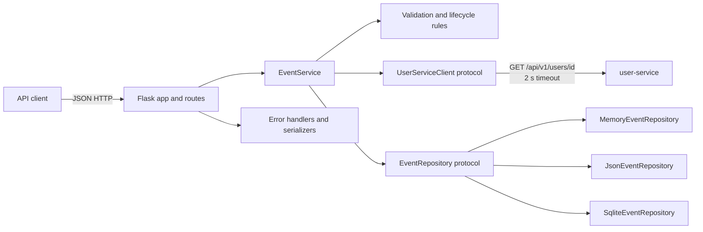
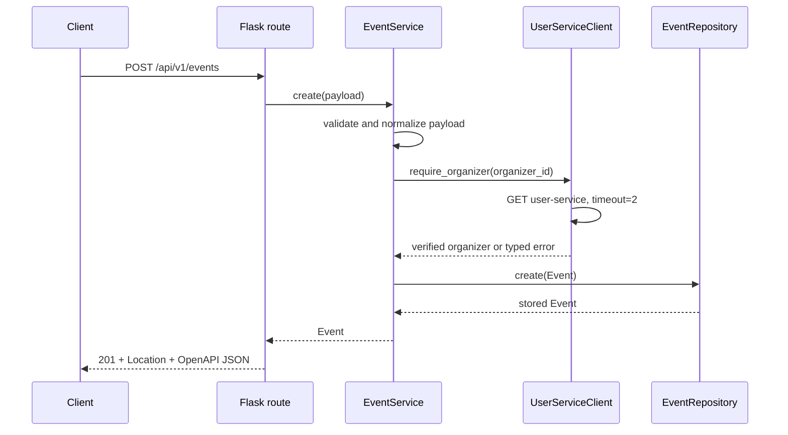

# Design Document — event-service

Contract reference: `Exam/techconf-exam/contracts/openapi/event-service.yaml` is the
immutable source of truth for paths, payloads, response schemas, and declared status
codes.

## Overview

The event-service is a Python 3.12 and Flask microservice rooted at
`Exam/techconf-exam/services/event-service`. It owns TechConf Event records, enforces
field and lifecycle rules, and verifies organizers through user-service. The service
runs as `python -m app` from its own directory so the acceptance harness can use
`cwd: services/event-service` relative to `Exam/techconf-exam`.

The design uses four explicit boundaries:

1. **HTTP boundary** — Flask routes parse requests and translate domain results to the
   immutable OpenAPI representation.
2. **Application/domain boundary** — `EventService` performs validation, organizer
   verification, lifecycle enforcement, and timestamp management.
3. **Persistence boundary** — one `EventRepository` protocol supports memory, JSON,
   and SQLite implementations without exposing storage details to business logic.
4. **Dependency boundary** — `UserServiceClient` is the only component that performs
   outbound HTTP and translates user-service outcomes into typed domain errors.

This separation keeps REQ-EVT-B01 through REQ-EVT-B06 independently testable and makes
backend changes invisible to routes and business rules.

### Design Goals

- Match every schema and operation in the OpenAPI contract without additional response
  fields.
- Keep validation and lifecycle decisions deterministic and independent of Flask,
  storage, and HTTP transport.
- Use environment-only runtime configuration with the exact defaults required by the
  platform.
- Preserve identical repository semantics across memory, JSON, and SQLite.
- Make user-service success, missing-reference, invalid-role, and failure mappings
  explicit and testable.
- Support unit, contract, and real-process integration tests with requirement IDs.

### Research Findings

The design was derived from local authoritative artifacts; no external research is
needed:

- `Exam/Exam.MD` defines the platform defaults, persistence modes, dependency mappings,
  required test levels, and IT-E01 through IT-E08 behavior.
- `Exam/techconf-exam/contracts/openapi/event-service.yaml` defines seven operations,
  rejects undeclared request/response properties, makes `description` nullable, and
  uses `EventCreate` for PUT and `EventUpdate` for PATCH.
- `Exam/techconf-exam/services.yaml` launches event-service with
  `cwd: services/event-service` and `command: python -m app`, while injecting `PORT`
  and inter-service URLs.
- The existing user-service exposes `GET /api/v1/users/{id}` and an application entry
  point compatible with real integration fixtures. Event-service therefore depends
  only on that HTTP contract and never imports user-service code.

These findings lead to a local application factory, strict response serializers, a
single outbound client, and independent per-service source and test trees.

### Key Decisions and Rationale

| Decision | Rationale |
|---|---|
| Domain `Event` uses `date`, timezone-aware `datetime`, `Decimal`, and an enum | Invalid states are rejected before persistence and currency/date behavior is not delegated to JSON or SQLite coercion. |
| API serializers are explicit rather than `dataclasses.asdict` | The OpenAPI schemas use `additionalProperties: false`; explicit serialization prevents accidental fields. |
| PUT retains current `status` when omitted and clears omitted optional `description` to null | `EventCreate` makes both fields optional; preserving lifecycle state avoids an implicit forbidden transition while retaining replacement semantics for descriptive data. |
| PATCH validates the merged Event | Cross-field rules such as `end_date >= start_date` must be checked against supplied and stored values together. |
| `updated_at` is generated by a monotonic helper | A successful mutation must produce a timestamp later than the stored timestamp even when two operations occur within one clock tick. |
| `UserServiceClient` has no automatic retry | The required timeout is two seconds; retries would multiply latency and obscure a dependency failure. |
| JSON writes use a temporary file plus `os.replace` under a process lock | Readers never observe a partially written JSON document, using only the standard library. |
| SQLite operations use transactions and parameterized statements | Atomic updates and safe values are provided by the standard library without an external DBMS. |
| Repositories return detached `Event` values | Callers cannot mutate stored state accidentally, preserving consistent semantics across all backends. |

## Architecture



### Request Flow



For GET and DELETE operations, `EventService` does not call user-service. PUT validates
the organizer contained in the complete payload. PATCH calls user-service only when
`organizer_id` changes. This avoids an unnecessary external dependency for local reads,
filters, lifecycle-only patches, and deletion while still validating every new
organizer reference.

### Source Layout

```text
Exam/techconf-exam/services/event-service/
├── app.py                         # create_app(), wiring, health, process entry point
├── config.py                      # environment parsing and defaults
├── errors.py                      # typed errors and Error_Body construction
├── pagination.py                  # page/page_size parsing
├── requirements.txt               # pinned runtime and test dependencies
├── pytest.ini                     # req marker registration and test paths
├── .coveragerc                    # production-code coverage scope
├── .gitignore                     # data/ and generated artifacts
├── README.md                      # startup, environment, API, and test commands
├── api/
│   ├── __init__.py
│   ├── routes.py                  # seven OpenAPI operations
│   └── serialization.py           # strict Event/Page JSON rendering
├── domain/
│   ├── __init__.py
│   ├── models.py                  # Event, EventStatus, EventFilters
│   ├── validation.py              # payload, field, date, price, transition rules
│   └── service.py                 # EventService use cases
├── clients/
│   ├── __init__.py
│   └── user_service.py            # UserServiceClient and requests adapter
├── repository/
│   ├── __init__.py
│   ├── base.py                    # EventRepository protocol
│   ├── memory_repo.py
│   ├── json_repo.py
│   ├── sqlite_repo.py
│   └── factory.py
└── tests/
    ├── conftest.py
    ├── unit/                      # domain, repository, client, route, contract tests
    └── integration/               # real user-service + event-service processes
```

The service contains no imports from another service directory. Cross-service coupling
is exclusively HTTP through the immutable contracts.

## Components and Interfaces

### Configuration (`config.py`)

An immutable settings object is built at application startup:

```python
@dataclass(frozen=True, slots=True)
class Settings:
    port: int = 5002
    user_service_url: str = "http://localhost:5001"
    storage_backend: str = "memory"
    data_dir: Path = Path("./data")
    user_service_timeout_seconds: float = 2.0


def load_settings(environ: Mapping[str, str] | None = None) -> Settings: ...
```

`PORT`, `USER_SERVICE_URL`, `STORAGE_BACKEND`, and `DATA_DIR` are read once. The URL is
normalized by removing one trailing slash before paths are appended. Invalid local
configuration fails during application startup with a descriptive exception rather
than producing partially configured request behavior. The two-second timeout is a
platform constant and is injected into the HTTP adapter for testability.

### Application Composition (`app.py`)

`create_app(settings=None, repository=None, user_client=None) -> Flask` constructs the
object graph. Defaults come from `load_settings`, `repository.factory`, and
`RequestsUserServiceClient`; tests inject fakes. The app registers:

- the event blueprint;
- JSON handlers for typed domain errors and Flask 400/404/405 errors;
- `GET /health`, which has no repository or user-service dependency;
- `app.extensions["event_service"]` for route access without module globals.

The module entry point calls `app.run(host="0.0.0.0", port=settings.port)` so the
acceptance harness can select non-development ports through `PORT`.

### HTTP API (`api/routes.py`)

| Method and path | OpenAPI operation | Route-to-service call | Success |
|---|---|---|---|
| `GET /health` | `health` | local health function | 200 Health |
| `POST /api/v1/events` | `createEvent` | `EventService.create(payload)` | 201 Event + `Location` |
| `GET /api/v1/events` | `listEvents` | `EventService.list(filters, page, page_size)` | 200 EventPage |
| `GET /api/v1/events/{id}` | `getEvent` | `EventService.get(id)` | 200 Event |
| `PUT /api/v1/events/{id}` | `replaceEvent` | `EventService.replace(id, payload)` | 200 Event |
| `PATCH /api/v1/events/{id}` | `updateEvent` | `EventService.patch(id, payload)` | 200 Event |
| `DELETE /api/v1/events/{id}` | `deleteEvent` | `EventService.delete(id)` | 204 empty body |

Routes require a JSON object for POST, PUT, and PATCH. `request.get_json(silent=False)`
allows Flask to distinguish malformed JSON (400) from a valid JSON value of the wrong
shape (422). Routes do not contain business rules. They parse transport values, call
one application method, serialize the result, and choose the contract status/header.

### Domain Model and Validation (`domain/models.py`, `domain/validation.py`)

The validation module exposes focused pure functions:

```python
def parse_create_payload(payload: Mapping[str, object]) -> NewEventData: ...
def merge_update(event: Event, payload: Mapping[str, object]) -> EventChanges: ...
def validate_date_interval(start_date: date, end_date: date) -> None: ...
def validate_transition(current: EventStatus, requested: EventStatus) -> None: ...
def normalize_price(value: object) -> Decimal: ...
def next_updated_at(previous: datetime, now: datetime | None = None) -> datetime: ...
```

Validation rejects booleans where JSON integers/numbers are required, rejects unknown
and read-only fields, parses dates strictly with `date.fromisoformat` plus exact
`YYYY-MM-DD` round-trip formatting, and converts price through `Decimal(str(value))`.
Price is quantized to `Decimal("0.01")` for two-decimal EUR precision and must be
non-negative and finite. Domain validation completes before organizer HTTP calls, so an
invalid local payload does not trigger external traffic.

The lifecycle transition relation is the explicit set:

```text
(draft, published), (draft, cancelled), (published, cancelled)
```

A repeated status is accepted as an idempotent no-transition update. All other unequal
pairs raise `InvalidStatusTransitionError`.

### Application Service (`domain/service.py`)

```python
class EventService:
    def create(self, payload: Mapping[str, object]) -> Event: ...
    def list(
        self, filters: EventFilters, page: int, page_size: int
    ) -> Page[Event]: ...
    def get(self, event_id: UUID) -> Event: ...
    def replace(self, event_id: UUID, payload: Mapping[str, object]) -> Event: ...
    def patch(self, event_id: UUID, payload: Mapping[str, object]) -> Event: ...
    def delete(self, event_id: UUID) -> None: ...
```

Operation ordering is deliberate:

- **Create:** validate/normalize all local fields → verify organizer → generate UUID and
  UTC timestamps → persist.
- **List:** validate pagination/filters → repository query → construct Page.
- **Get:** repository lookup → `NotFoundError` when absent.
- **Replace:** lookup → validate full payload and merged lifecycle → verify payload
  organizer → preserve identity/creation time → advance update time → persist.
- **Patch:** lookup → validate merged Event → verify organizer only when changed →
  enforce lifecycle → preserve unspecified values → advance update time only for an
  actual value change → persist.
- **Delete:** lookup/delete atomically at repository boundary → `NotFoundError` when
  absent.

No repository write occurs before all validation and dependency checks succeed.

### User-Service Client (`clients/user_service.py`)

The domain depends on a protocol, not `requests`:

```python
class UserServiceClient(Protocol):
    def require_organizer(self, organizer_id: UUID) -> None: ...


class RequestsUserServiceClient:
    def __init__(self, base_url: str, timeout_seconds: float = 2.0) -> None: ...
    def require_organizer(self, organizer_id: UUID) -> None: ...
```

The adapter calls
`GET {USER_SERVICE_URL}/api/v1/users/{organizer_id}` with `timeout=2.0`. It does not
forward client headers or accept a URL from request data.

| User-service outcome | Client result | Event-service HTTP mapping |
|---|---|---|
| 200 and JSON object with matching `id`, `role = organizer` | return `None` | continue operation |
| 200 and valid user with another role | raise `InvalidOrganizerError` | 422 `INVALID_ORGANIZER` |
| 404 | raise `ReferenceNotFoundError` | 422 `REFERENCE_NOT_FOUND` |
| timeout, refused connection, or another `requests.RequestException` | raise `DependencyUnavailableError` | 503 `DEPENDENCY_UNAVAILABLE` |
| 5xx | raise `DependencyUnavailableError` | 503 `DEPENDENCY_UNAVAILABLE` |
| malformed JSON, non-object JSON, mismatched id, missing role, or unexpected status | raise `DependencyUnavailableError` | 503 `DEPENDENCY_UNAVAILABLE` |

The adapter uses a private `requests.Session`, allowing connection reuse while retaining
an injectable session in unit tests. Response bodies are never copied into public error
messages.

### Repository Abstraction (`repository/base.py`)

```python
class EventRepository(Protocol):
    def create(self, event: Event) -> Event: ...
    def get(self, event_id: UUID) -> Event | None: ...
    def list(
        self, filters: EventFilters, offset: int, limit: int
    ) -> tuple[list[Event], int]: ...
    def replace(self, event: Event) -> Event: ...
    def delete(self, event_id: UUID) -> bool: ...
```

All implementations sort by `(created_at, id)` before slicing, apply `status` and `city`
filters before calculating `total`, return detached values, and use the same strict
Event serializer/deserializer. `replace` stores the complete domain Event; PATCH merging
belongs to `EventService`.

- **MemoryEventRepository:** dictionary keyed by UUID protected by `threading.RLock`.
- **JsonEventRepository:** `DATA_DIR/events.json`, one top-level object with a schema
  version and Event records; mutation uses lock, read-modify-write, `fsync`, and atomic
  `os.replace`.
- **SqliteEventRepository:** `DATA_DIR/events.db`, one `events` table; connections use
  row factories, parameterized SQL, context-managed transactions, and an index on
  `(status, city)`.
- **Factory:** accepts only `memory`, `json`, or `sqlite`, creates `DATA_DIR` only for a
  file-backed backend, and returns the protocol type.

### Serialization (`api/serialization.py` and repository codec)

Two serializers have distinct responsibilities:

- The API serializer emits only OpenAPI Event fields. UUID/date/datetime values become
  strings, timestamps end in `Z`, `price` becomes a JSON number at two-decimal
  precision, and nullable `description` may be emitted as null.
- The repository codec converts every domain field to a JSON/SQLite-safe primitive and
  reconstructs an equivalent validated Event. The same codec is shared by JSON and
  SQLite repository adapters, not by route code.

`serialize_page` emits exactly `items`, `page`, `page_size`, and `total`. The health and
error serializers likewise use explicit key sets.

## Data Models

### Event

```python
class EventStatus(str, Enum):
    DRAFT = "draft"
    PUBLISHED = "published"
    CANCELLED = "cancelled"


@dataclass(frozen=True, slots=True)
class Event:
    id: UUID
    title: str
    description: str | None
    organizer_id: UUID
    venue: str
    city: str
    start_date: date
    end_date: date
    capacity: int
    price: Decimal
    status: EventStatus
    created_at: datetime
    updated_at: datetime
```

| Field | Domain/storage rule | API representation |
|---|---|---|
| `id` | UUID v4, generated once by EventService | UUID string |
| `title` | 3–120 characters | string |
| `description` | null or at most 2000 characters | string or null |
| `organizer_id` | UUID verified through UserServiceClient | UUID string |
| `venue` | string, at most 100 characters | string |
| `city` | string, at most 60 characters | string |
| `start_date` | valid `date` | `YYYY-MM-DD` |
| `end_date` | valid `date`, not before start | `YYYY-MM-DD` |
| `capacity` | integer 1–10000; boolean rejected | integer |
| `price` | finite non-negative Decimal quantized to 0.01 | JSON number |
| `status` | EventStatus, default draft on create | enum string |
| `created_at` | timezone-aware UTC datetime, immutable | ISO 8601 UTC with `Z` |
| `updated_at` | timezone-aware UTC datetime, monotonic on change | ISO 8601 UTC with `Z` |

### Input and Query Models

```python
@dataclass(frozen=True, slots=True)
class NewEventData:
    title: str
    description: str | None
    organizer_id: UUID
    venue: str
    city: str
    start_date: date
    end_date: date
    capacity: int
    price: Decimal
    status: EventStatus = EventStatus.DRAFT


@dataclass(frozen=True, slots=True)
class EventFilters:
    status: EventStatus | None = None
    city: str | None = None


@dataclass(frozen=True, slots=True)
class Page(Generic[T]):
    items: tuple[T, ...]
    page: int
    page_size: int
    total: int
```

The Page offset is `(page - 1) * page_size`. Filtering precedes pagination. A page past
the final result returns an empty `items` list while preserving the filtered `total`.

### JSON Persistence Shape

```json
{
  "schema_version": 1,
  "events": [
    {
      "id": "00000000-0000-4000-8000-000000000000",
      "title": "Cloud Conference",
      "description": null,
      "organizer_id": "00000000-0000-4000-8000-000000000001",
      "venue": "Auditorium Roma",
      "city": "Roma",
      "start_date": "2026-10-15",
      "end_date": "2026-10-16",
      "capacity": 250,
      "price": "149.00",
      "status": "draft",
      "created_at": "2026-01-10T10:00:00Z",
      "updated_at": "2026-01-10T10:00:00Z"
    }
  ]
}
```

The persistence representation stores Decimal as a string to avoid binary floating
point loss; the public API still emits an OpenAPI number. Unknown schema versions fail
repository initialization instead of silently corrupting data.

### SQLite Schema

```sql
CREATE TABLE IF NOT EXISTS events (
    id TEXT PRIMARY KEY,
    title TEXT NOT NULL,
    description TEXT NULL,
    organizer_id TEXT NOT NULL,
    venue TEXT NOT NULL,
    city TEXT NOT NULL,
    start_date TEXT NOT NULL,
    end_date TEXT NOT NULL,
    capacity INTEGER NOT NULL,
    price TEXT NOT NULL,
    status TEXT NOT NULL,
    created_at TEXT NOT NULL,
    updated_at TEXT NOT NULL
);
CREATE INDEX IF NOT EXISTS idx_events_status_city
    ON events(status, city);
```

Domain validation remains authoritative for constraints so all three repositories have
identical behavior. SQLite constraints provide storage integrity but do not replace
business validation.

### Domain Invariants

For every persisted Event:

- `end_date >= start_date`;
- `1 <= capacity <= 10000`;
- `price >= Decimal("0.00")` and has two-decimal precision;
- status belongs to EventStatus;
- `created_at <= updated_at` and both timestamps are UTC;
- id is UUID v4 and read-only;
- organizer_id has been accepted by UserServiceClient before creation or organizer
  replacement.

## Correctness Properties

Property-based testing is applicable because event-service contains pure validation,
normalization, lifecycle, filtering, pagination, serialization, and repository-model
logic over large input spaces. HTTP wiring and external-service availability remain
example-based or integration concerns.

*A property is a characteristic or behavior that should hold true across all valid
executions of a system—essentially, a formal statement about what the system should do.
Properties serve as the bridge between human-readable specifications and
machine-verifiable correctness guarantees.*

### Property Reflection

The acceptance-criteria prework classified all 112 criteria. Reflection removed
redundancy as follows:

- all per-field payload rules are represented by one reference-predicate property
  rather than one property per field;
- the three allowed transitions, idempotent same-state updates, and all forbidden
  transitions are one complete state-machine property;
- individual status/city filter criteria are combined into one filter-conjunction and
  confluence property;
- CRUD round trips, deletion absence, JSON/SQLite persistence, and cross-backend
  behavior are consolidated into one model-based repository property, while codec
  round-trip correctness remains separate;
- PUT and PATCH each have one comprehensive state-transform property;
- exact response keys and snake_case naming are one serialization property;
- HTTP status examples, malformed JSON, process configuration, and real dependency
  behavior remain unit, contract, integration, or smoke tests rather than artificial
  properties.

### Property 1: Valid creation produces normalized domain invariants

For any valid Event_Create_Payload and verified Organizer, creating an Event produces a
UUID-v4 identity, UTC timestamps, a finite non-negative two-decimal price, the supplied
valid status or `draft` when status is omitted, and all other normalized payload values.

**Validates: Requirements 1.2, 1.3, 1.7, 1.8, 2.10**

### Property 2: Invalid payload rejection is side-effect free

For any JSON object that violates at least one Event create/replace field predicate,
Event_Service returns `VALIDATION_ERROR` before an organizer call or repository write,
and the Repository state remains unchanged.

**Validates: Requirements 2.1, 2.2, 2.3, 2.4, 2.5, 2.6, 2.7, 2.8, 2.9,
2.11, 2.12, 10.11, 13.6**

### Property 3: Date interval acceptance matches chronological order

For any pair of valid calendar dates, Event_Service accepts the pair exactly when
`end_date >= start_date`; for any update of either date, the same predicate applies to
the complete merged Event.

**Validates: Requirements 5.1, 5.2, 5.3, 11.4**

### Property 4: Lifecycle behavior equals the declared transition relation

For any current and requested Event_Status, Event_Service accepts the update exactly
when both statuses are equal or the pair is (`draft`, `published`), (`draft`,
`cancelled`), or (`published`, `cancelled`); applying a same-status update repeatedly
is idempotent.

**Validates: Requirements 6.1, 6.2, 6.3, 6.4, 6.5, 10.6, 11.3**

### Property 5: Mutation timestamps are strictly monotonic

For any prior UTC `updated_at` value and any clock value, every successful value-changing
PUT, PATCH, or lifecycle mutation produces an `updated_at` later than the prior value.

**Validates: Requirements 6.6, 10.8, 11.7**

### Property 6: User-service 5xx responses map to dependency failure

For any integer HTTP status from 500 through 599 returned by User_Service, the
UserServiceClient raises `DependencyUnavailableError`, which maps to HTTP 503 with code
`DEPENDENCY_UNAVAILABLE`.

**Validates: Requirements 7.3**

### Property 7: Event filters implement intersection and confluence

For any Event collection and optional valid status and city filters, every returned
Event satisfies all supplied filters, every source Event satisfying all filters appears
before pagination, and applying the two filters in either order yields the same set.

**Validates: Requirements 8.3, 8.5, 8.6, 8.7**

### Property 8: Pagination equals deterministic reference slicing

For any Event collection, valid filters, page number, and page size, listing returns the
slice `[(page-1)*page_size : page*page_size]` of the filtered `(created_at, id)` order,
reports the full filtered total, and repeats with the same ordered result.

**Validates: Requirements 8.2, 8.3, 8.4**

### Property 9: Status query parsing accepts exactly EventStatus values

For any query-string value, status-filter parsing succeeds exactly when the value is
`draft`, `published`, or `cancelled`; every other value produces `VALIDATION_ERROR`.

**Validates: Requirements 8.10**

### Property 10: Repository codec round trip preserves Events

For any valid Event, encoding the Event to persistence primitives and then decoding the
encoded value produces an equivalent Event, including UUID, Decimal, date, UTC
timestamp, nullable description, and Event_Status values.

**Validates: Requirements 9.1, 15.2, 15.3, 15.6**

### Property 11: Every repository backend conforms to one state model

For any valid initial Event set and generated sequence of create, get, list, replace,
and delete commands, memory, JSON, and SQLite repositories produce observations equal
to the same reference model; reopening a file-backed repository preserves that model,
and deleted Events remain absent.

**Validates: Requirements 1.1, 8.2, 8.3, 8.4, 8.5, 8.6, 8.7, 9.1, 12.1,
12.4, 15.1, 15.2, 15.3, 15.6**

### Property 12: PUT is a complete identity-preserving replacement

For any stored Event and valid replacement payload accepted by organizer and lifecycle
rules, PUT replaces every supplied mutable value, sets omitted `description` to null,
retains status when omitted, preserves `id` and `created_at`, and persists exactly the
returned Event.

**Validates: Requirements 10.1, 10.2, 10.3, 10.7, 10.8**

### Property 13: PATCH changes only the requested projection

For any stored Event and valid Event_Update_Payload, PATCH changes exactly the supplied
fields after normalization, preserves every unspecified field plus `id` and
`created_at`, leaves the complete Event unchanged for an empty or equal-value patch,
and advances `updated_at` exactly when a value changes.

**Validates: Requirements 11.1, 11.5, 11.6, 11.7**

### Property 14: API serialization is OpenAPI-exact

For any valid Event, Page, or Error value, API serialization emits every required key,
no undeclared key, snake_case field names, contract-compatible primitive types, UTC
`Z` timestamps, and a numeric two-decimal price.

**Validates: Requirements 1.6, 2.10, 8.3, 13.1, 17.3, 17.4**

### Property 15: Error details survive serialization

For any JSON-compatible details object and any supported error code/message,
constructing and serializing Error_Body preserves that details object exactly while
retaining the required code and message.

**Validates: Requirements 13.1, 13.2**

## Error Handling

### Error Types and HTTP Mapping

| Source condition | Typed error or handler | HTTP | Error code |
|---|---|---:|---|
| Malformed JSON | Flask `BadRequest` handler | 400 | `BAD_REQUEST` |
| Missing, unknown, read-only, wrong-type, range, date, or query value | `ValidationError` | 422 | `VALIDATION_ERROR` |
| user-service returns 404 | `ReferenceNotFoundError` | 422 | `REFERENCE_NOT_FOUND` |
| user-service returns a non-organizer | `InvalidOrganizerError` | 422 | `INVALID_ORGANIZER` |
| Forbidden lifecycle change | `InvalidStatusTransitionError` | 422 | `INVALID_STATUS_TRANSITION` |
| Event absent | `NotFoundError` | 404 | `NOT_FOUND` |
| user-service timeout/refusal/transport error/5xx/unusable response | `DependencyUnavailableError` | 503 | `DEPENDENCY_UNAVAILABLE` |
| Unsupported method on a declared route | Flask 405 handler | 405 | `METHOD_NOT_ALLOWED` |

Every handler calls one `make_error_body(code, message, details=None)` function and
returns JSON. `details` contains field-level context where available but never includes
exception traces, dependency response bodies, credentials, or internal file paths.
Event-service has no domain conflict that produces 409; it therefore emits only the
operation-specific statuses required by its contract and the platform-level 405.

### Failure Atomicity

- Local payload and cross-field validation occurs before outbound calls.
- Required organizer validation occurs before repository mutation.
- Lifecycle validation occurs before replacement mutation.
- JSON replacement is atomic at filesystem level; SQLite mutation is transactional.
- A validation, reference, role, transition, or dependency error leaves repository
  state unchanged.
- GET, list, delete, and health do not require user-service availability.

### Transport Boundaries

POST, PUT, and PATCH distinguish malformed JSON (400) from a valid JSON value that is
not an object (422). A Resource_ID that does not resolve to an Event returns the
contract-declared 404. Error responses use `application/json`; successful DELETE uses a
truly empty 204 body. `Location` is present only on successful creation.

## Testing Strategy

Testing combines focused examples, property tests, contract validation, and real HTTP
integration. Every authored test carries a requirement marker such as
`@pytest.mark.req("REQ-EVT-B04")`, or includes the requirement ID in its test name or
docstring.

### Test Dependencies and Configuration

Use pinned test dependencies compatible with the existing project baseline:

- `pytest==8.3.4`, `pytest-cov==6.0.0`;
- `responses==0.25.3` for mocked requests transport;
- `hypothesis==6.130.4` for property-based tests;
- `PyYAML==6.0.2` and `jsonschema==4.23.0` for the immutable contract validator.

Runtime dependencies are pinned separately in the same service manifest:
`Flask==3.1.1` and `requests==2.32.3`. No database package is needed because SQLite
comes from Python 3.12's standard library.

`pytest.ini` registers the `req` and `integration` markers. `.coveragerc` measures
production modules and omits tests, generated data, and the process-entry guard.

### Unit and Example Tests

| Test area | Main checks |
|---|---|
| Configuration/app factory | all environment defaults/overrides, dependency injection, health independence, `python -m app` composition |
| Validation/model | every field boundary, strict dates, Decimal normalization, unknown/read-only fields, merged date rules |
| Lifecycle | all nine current/requested status pairs, same-status idempotence, monotonic timestamps |
| Application service | create/get/list/replace/patch/delete ordering, no writes on error, organizer client call/no-call behavior |
| Memory repository | CRUD, detached values, ordering, filters, pagination, no file creation |
| JSON repository | CRUD and reopen persistence under `tmp_path`, atomic replacement, corrupt/unsupported file handling |
| SQLite repository | CRUD and reopen persistence under `tmp_path`, transactions, filters, pagination |
| User-service client | exact URL/method/2-second timeout; 200 organizer; 200 attendee/speaker; 404; every 5xx; timeout/refusal; malformed responses |
| Routes/errors | status, headers, JSON shape, malformed JSON, absent resources, unsupported methods, empty DELETE body |

Repository contract tests are parameterized over all three backends. JSON and SQLite
use a fresh `tmp_path`; no test writes to repository source directories.

### Property-Based Tests

Hypothesis executes each design property with at least 100 generated examples. Each
property maps to exactly one test function and includes a comment in this format:

```python
# Feature: event-service, Property 4: Lifecycle behavior equals the declared transition relation
```

Properties 1–5 and 7–9 test pure domain functions; Property 6 uses an injected mocked
HTTP session; Properties 10–11 test codecs/repository model behavior in temporary
storage; Properties 12–13 test service transformations with fakes; Properties 14–15
test strict serializers. Generators produce Unicode boundary strings, leap dates,
UUID-v4 values, finite Decimal prices, all lifecycle states, page boundaries, nullable
descriptions, and arbitrary JSON-compatible error details. Targeted examples still
cover malformed transport data and exact integration outcomes; property tests do not
replace them.

### OpenAPI Contract Tests

At least one test for every operation adapts the Flask response to the validator's
plain-dictionary interface:

```python
contract_response = {
    "status_code": response.status_code,
    "headers": dict(response.headers),
    "json": response.get_json(silent=True),
}
assert_matches_contract("event-service", method, path, contract_response)
```

The required operation matrix is:

1. `GET /health` (`health`);
2. `POST /api/v1/events` (`createEvent`), including `Location` assertion;
3. `GET /api/v1/events` (`listEvents`);
4. `GET /api/v1/events/{id}` (`getEvent`);
5. `PUT /api/v1/events/{id}` (`replaceEvent`);
6. `PATCH /api/v1/events/{id}` (`updateEvent`);
7. `DELETE /api/v1/events/{id}` (`deleteEvent`, with null body adaptation).

Additional contract tests validate representative 400, 404, 422, and 503 bodies. Tests
import `contracts.validator` from the immutable TechConf repository; they neither copy
nor modify contract files.

### Real-Service Integration Tests

Pytest fixtures allocate free loopback ports, start the actual user-service and
event-service commands in subprocesses using their configured working directories,
poll `/health` with a bounded deadline, yield service URLs, and terminate/wait for every
process in `finally` blocks. The fixtures inject `PORT`, `USER_SERVICE_URL`,
`STORAGE_BACKEND=memory`, and an isolated `DATA_DIR`; they do not rely on development
ports or manually running servers.

The authored event-service integration suite contains at least:

1. **Positive organizer flow** — create a real user with role `organizer`, POST an Event
   through real HTTP, and assert 201 plus contract-valid Event (REQ-EVT-B01/B02,
   IT-E01).
2. **Missing organizer flow** — POST with an absent UUID while real user-service is
   running and assert 422 `REFERENCE_NOT_FOUND` (REQ-EVT-B01, IT-E02).
3. **Dependency-down flow** — start event-service with `USER_SERVICE_URL` on a reserved
   closed port and assert 503 `DEPENDENCY_UNAVAILABLE` within the bounded timeout
   (REQ-EVT-B05, IT-E08).

A focused real non-organizer case may supplement the minimum suite; attendee/speaker
mapping is mandatory in unit tests.

### Coverage and Commands

From `Exam/techconf-exam/services/event-service`:

```text
python -m pytest -m "not integration" --cov=. --cov-report=term-missing --cov-fail-under=80
python -m pytest tests/integration -v
python -m pytest --cov=. --cov-report=term-missing --cov-fail-under=80
```

The final run must report at least 80% production-code coverage. After implementation,
the immutable acceptance suite is run separately from `Exam/techconf-exam`; contract
and instructor test files remain unchanged.

## Requirements Traceability

| Design area | Requirements |
|---|---|
| Flask composition, routes, serializers | REQ-EVT-C01–C06, REQ-EVT-H01, REQ-EVT-OA01 |
| Field and cross-field validation | REQ-EVT-V01, REQ-EVT-B03 |
| Organizer client | REQ-EVT-B01, REQ-EVT-B02, REQ-EVT-B05, REQ-EVT-CFG01 |
| Lifecycle state machine | REQ-EVT-B04 |
| Filtering and pagination | REQ-EVT-B06, REQ-EVT-C02 |
| Error mapping | REQ-EVT-ERR01, REQ-EVT-B01, REQ-EVT-B02, REQ-EVT-B04, REQ-EVT-B05 |
| Repository protocol and three adapters | REQ-EVT-S01 |
| Environment and process entry point | REQ-EVT-CFG01, REQ-EVT-PLAT01 |
| Unit/property/contract/integration tests | all requirements; explicit focus on REQ-EVT-B01–B06 and REQ-EVT-OA01 |
